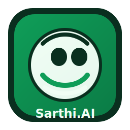

# 🎓 Sarthi.AI

<div align="center">



**AI-Powered Teaching Assistant for Educators**

*Empowering teachers in low-resource environments with intelligent, just-in-time support*

[](https://opensource.org/licenses/MIT)
[](https://nextjs.org/)
[](https://www.typescriptlang.org/)
[](https://firebase.google.com/)
[](https://ai.google.dev/)

</div>

---

## 📋 Table of Contents

- [Overview](#-overview)
- [Key Features](#-key-features)
- [Features in Detail](#-features-in-detail)
  - [1. Lesson Planner](#1-lesson-planner)
  - [2. Classrooms](#2-classrooms)
  - [3. Grades](#3-grades)
  - [4. Differentiated Worksheets](#4-differentiated-worksheets)
  - [5. Visual Aids](#5-visual-aids)
  - [6. Knowledge Base](#6-knowledge-base)
  - [7. Local Content](#7-local-content)
  - [8. Teacher Companion](#8-teacher-companion)
- [Tech Stack](#-tech-stack)
- [Getting Started](#-getting-started)
- [Installation](#-installation)
- [Configuration](#-configuration)
- [Usage](#-usage)
- [Project Structure](#-project-structure)
- [Multi-Language Support](#-multi-language-support)
- [Contributing](#-contributing)
- [License](#-license)

---

## 🧠 Overview

**Sarthi.AI** is an intelligent teaching assistant designed to support educators, especially those working in government schools and low-resource environments. Built with cutting-edge AI technology, Sarthi.AI automates lesson planning, generates educational content, manages classrooms, and provides just-in-time support when teachers need it most.

### Why Sarthi.AI?

- **🤖 AI-Powered**: Leverages Google Gemini AI for intelligent content generation
- **🌍 Multi-Language**: Supports 5 languages (English, Hindi, Marathi, Bengali, Tamil)
- **📱 Offline-Friendly**: Works in low-connectivity environments
- **🎯 Just-in-Time Support**: Get help when you need it, not just during training
- **👥 Classroom Management**: Organize students, share materials, track progress
- **📊 Data-Driven**: Track grades and student performance with analytics

---

## ✨ Key Features

- 📚 **AI Lesson Planner** - Generate comprehensive weekly lesson plans in seconds
- 👥 **Classrooms** - Create and manage virtual classrooms with join codes
- 📊 **Grades Management** - Upload, track, and analyze student performance
- 📝 **Differentiated Worksheets** - Generate worksheets for multiple grade levels from a single source
- 🎨 **Visual Aids Generator** - Create simple diagrams and visual content for teaching
- 🧠 **Knowledge Base** - Instant explanations with analogies in multiple languages
- 🌍 **Local Content** - Culturally relevant stories and examples
- 🎯 **Teacher Companion** - Real-time coaching and support during classes

---

## 🎯 Features in Detail

### 1. Lesson Planner

**Generate AI-powered weekly lesson plans with objectives and activities.**

The Lesson Planner feature helps teachers create comprehensive, structured lesson plans in seconds. Simply select your subject, topic, grade level, and language, and Sarthi.AI generates a complete weekly plan with learning objectives, activities, and assessment strategies.

**Key Capabilities:**
- Generate weekly lesson plans instantly
- Customize by subject, topic, grade, and language
- Includes learning objectives and activities
- Share plans with students via classrooms
- Save and reuse plans for future classes

**How it Works:**
1. Select subject, topic, grade level, and language
2. Add optional details or specific requirements
3. Click "Generate" and receive a complete lesson plan
4. Review, edit if needed, and share with your classroom

<!-- Image placeholder for Lesson Planner -->
<div align="center">


*Add your Lesson Planner screenshot here*

</div>

---

### 2. Classrooms

**Create and manage virtual classrooms. Share updates, worksheets, and files. Students join with a code.**

Classrooms function like Google Classroom, allowing teachers to create virtual learning spaces where they can share materials, post announcements, distribute worksheets, and manage student interactions.

**Key Capabilities:**
- Create multiple classrooms (Grade + Section)
- Generate unique join codes for students
- Post messages, worksheets, lesson plans, files, and images
- View classroom feed with all updates
- Manage members (teachers and students)
- Real-time updates and notifications

**How it Works:**
1. Create a new classroom with grade and section
2. Get a unique join code
3. Share the code with students
4. Post materials, announcements, and assignments
5. Students can view and access shared content

<!-- Image placeholder for Classrooms -->
<div align="center">


*Add your Classrooms screenshot here*

</div>

---

### 3. Grades

**Upload student grades (Excel/CSV) and track class performance with analytics.**

The Grades feature simplifies grade management by allowing teachers to upload grade files and automatically track student performance. View class statistics, individual student progress, and generate reports.

**Key Capabilities:**
- Upload grades via Excel or CSV files
- Automatic data parsing and organization
- View class performance statistics
- Track individual student progress over time
- Export data for reporting
- Visual charts and analytics

**How it Works:**
1. Prepare your grades file (Excel/CSV format)
2. Upload the file through the interface
3. System automatically parses and organizes data
4. View class performance dashboard
5. Track individual student progress
6. Export data when needed

<!-- Image placeholder for Grades -->
<div align="center">


*Add your Grades screenshot here*

</div>

---

### 4. Differentiated Worksheets

**Upload a textbook page photo → Get worksheets for different grade levels.**

This powerful feature allows teachers to create differentiated worksheets for multiple grade levels from a single source. Perfect for mixed-ability classrooms where students need content adapted to their level.

**Key Capabilities:**
- Upload textbook pages via photo or file
- Generate worksheets for multiple grade levels simultaneously
- AI adapts content complexity automatically
- Download as PDF
- Share directly to classrooms
- Customize instructions and requirements

**How it Works:**
1. Upload a textbook page (drag & drop or click to upload)
2. Enter target grade levels (e.g., `3, 4, 5`)
3. Add optional instructions or requirements
4. Click "Generate Worksheets"
5. Review generated worksheets for each grade
6. Download as PDF or share to a classroom

<!-- Image placeholder for Differentiated Worksheets -->
<div align="center">


*Add your Differentiated Worksheets screenshot here*

</div>

---

### 5. Visual Aids

**Describe a concept → Get a simple diagram you can replicate on the board.**

Visual Aids Generator helps teachers create simple, clear diagrams and visual content that can be easily replicated on a blackboard or whiteboard. Perfect for explaining complex concepts visually.

**Key Capabilities:**
- Generate diagrams from text descriptions
- Choose from different visual styles
- Simple line drawings perfect for board replication
- Download or save visual aids
- Share with students via classrooms

**How it Works:**
1. Type a description of the concept (e.g., "water cycle with evaporation, condensation, rain")
2. Choose visual style preference
3. Click "Generate"
4. Receive a clear, simple diagram
5. Use it as a reference to draw on the board

<!-- Image placeholder for Visual Aids -->
<div align="center">


*Add your Visual Aids screenshot here*

</div>

---

### 6. Knowledge Base

**Ask any question → Get simple, accurate explanations with analogies.**

The Knowledge Base is an AI-powered Q&A system that provides clear, simple explanations to any educational question. Perfect for both teachers who need quick clarifications and students who want to learn independently.

**Key Capabilities:**
- Ask questions in natural language
- Get explanations with analogies and examples
- Support for 5 languages
- Simple, student-friendly language
- Instant responses
- Save frequently asked questions

**How it Works:**
1. Type a student-style question (e.g., "Why is the sky blue?")
2. Select your preferred language
3. Click "Explain"
4. Receive a clear, accurate answer with analogies
5. Share explanations with students if needed

<!-- Image placeholder for Knowledge Base -->
<div align="center">


*Add your Knowledge Base screenshot here*

</div>

---

### 7. Local Content

**Request culturally relevant stories, examples, or explanations in your language.**

Local Content Generator creates culturally relevant educational content that resonates with students' local context. Generate stories, examples, and explanations that use local references, making learning more relatable and engaging.

**Key Capabilities:**
- Generate culturally relevant content
- Support for 5 languages
- Local examples and references
- Stories tailored to regional context
- Customizable content requests
- Share with students

**How it Works:**
1. Type a request (e.g., "a short story about a farmer and the seasons for Grade 4")
2. Choose your language
3. Click "Generate"
4. Receive hyper-local content with local examples
5. Use in lessons or share with students

<!-- Image placeholder for Local Content -->
<div align="center">


*Add your Local Content screenshot here*

</div>

---

### 8. Teacher Companion

**Just-in-time coaching when a class goes off track.**

Teacher Companion is the core feature that provides real-time support to teachers during live classes. When things don't go as planned, teachers can get instant, actionable advice to get back on track.

**Three Modes:**

#### a) Sunita-style Scenarios
Select from predefined scenarios based on class level, subject, and problem type. Get instant, structured guidance.

- Select: Class (3–5), Subject (Math/Hindi/EVS), Problem type
- Get: Headline, quick plan, 4–6 just-in-time steps, grouping ideas, activity tweak, follow-up

#### b) Text Snapshot
Describe your situation in a paragraph and get personalized advice.

- Describe the situation in detail
- Get: Strategy, grouping tips, activity tweak, follow-up checklist

#### c) Image Snapshot
Upload a photo of your board or class and get visual analysis with recommendations.

- Upload a photo of the board or classroom
- Add optional context (text or **voice input**)
- Get: Summary, engagement score, focus areas, grouping suggestions, strategies, activity tweak

**Special Features:**
- **Recent guidance** - Last 20 responses cached for offline use
- **Confidence meter** - Rate each response (Confident, Neutral, Still confused)
- **Voice input** - Speak the context instead of typing
- **Offline support** - Access recent guidance without internet

<!-- Image placeholder for Teacher Companion -->
<div align="center">


*Add your Teacher Companion screenshot here*

</div>

---

## 🛠️ Tech Stack

### Frontend
- **Framework**: [Next.js 16](https://nextjs.org/) with App Router
- **UI Library**: [React 19](https://react.dev/)
- **Language**: [TypeScript 5](https://www.typescriptlang.org/)
- **Styling**: [Tailwind CSS](https://tailwindcss.com/) + [ShadCN UI](https://ui.shadcn.com/)
- **State Management**: React Hooks + Context API

### Backend & Services
- **Authentication**: [Firebase Auth](https://firebase.google.com/docs/auth)
- **Database**: [Cloud Firestore](https://firebase.google.com/docs/firestore)
- **Storage**: [Firebase Storage](https://firebase.google.com/docs/storage)
- **Hosting**: Firebase Hosting (optional)

### AI & Machine Learning
- **AI Framework**: [Genkit](https://github.com/firebase/genkit)
- **AI Model**: [Google Gemini 2.5 Flash](https://ai.google.dev/)
- **AI Integration**: @genkit-ai/googleai

### Additional Libraries
- **i18n**: react-i18next (5 languages support)
- **Forms**: react-hook-form + zod validation
- **Charts**: Recharts
- **PDF Generation**: jsPDF + html2canvas
- **File Processing**: xlsx for Excel/CSV handling

---

## 🚀 Getting Started

### Prerequisites

Before you begin, ensure you have the following installed:

- **Node.js** 18+ and npm (or yarn/pnpm)
- **Firebase account** (free tier works)
- **Google AI Studio account** (for Gemini API key - free tier available)

### Installation

1. **Clone the repository**
   ```bash
   git clone https://github.com/deepakm0003/Sarthi.AI.git
   cd Sarthi.AI
   ```

2. **Install dependencies**
   ```bash
   npm install
   ```

3. **Set up environment variables**

   Create a `.env.local` file in the root directory:
   ```env
   # Firebase Configuration
   NEXT_PUBLIC_FIREBASE_API_KEY=your-api-key
   NEXT_PUBLIC_FIREBASE_AUTH_DOMAIN=your-project.firebaseapp.com
   NEXT_PUBLIC_FIREBASE_PROJECT_ID=your-project-id
   NEXT_PUBLIC_FIREBASE_STORAGE_BUCKET=your-project.appspot.com
   NEXT_PUBLIC_FIREBASE_MESSAGING_SENDER_ID=your-sender-id
   NEXT_PUBLIC_FIREBASE_APP_ID=your-app-id

   # Google Gemini API Key
   GEMINI_API_KEY=your-gemini-api-key
   ```

4. **Configure Firebase**

   - Create a new Firebase project at [Firebase Console](https://console.firebase.google.com/)
   - Enable **Email/Password** authentication
   - Create a **Firestore** database (start in test mode)
   - Enable **Storage**
   - Copy your Firebase config to `.env.local`

5. **Get Gemini API Key**

   - Visit [Google AI Studio](https://aistudio.google.com/)
   - Create an API key
   - Add it to `.env.local` as `GEMINI_API_KEY`

6. **Run the development server**
   ```bash
   npm run dev
   ```

7. **Open your browser**
   ```
   http://localhost:3000
   ```

### Configuration

For detailed setup instructions, see [SETUP.md](./SETUP.md)

---

## 📖 Usage

### For Teachers

1. **Sign up** or **log in** to your account
2. **Create a profile** with your role (teacher)
3. **Access features** from the sidebar:
   - Create lesson plans
   - Set up classrooms
   - Upload and track grades
   - Generate worksheets and visual aids
   - Use Teacher Companion for real-time support

### For Students

1. **Sign up** or **log in** to your account
2. **Create a profile** with your role (student)
3. **Join a classroom** using the join code from your teacher
4. **Access features**:
   - View classroom feed and materials
   - Check your grades
   - Use Knowledge Base for questions
   - Request Local Content

---

## 📁 Project Structure

```
Sarthi.AI/
├── src/
│   ├── app/                    # Next.js App Router pages
│   │   ├── (features)/        # Feature pages (protected routes)
│   │   │   ├── classrooms/    # Classroom management
│   │   │   ├── grades/        # Grade tracking
│   │   │   ├── lesson-planner/# Lesson planning
│   │   │   ├── worksheets/    # Worksheet generation
│   │   │   ├── visual-aids/  # Visual aids generator
│   │   │   ├── knowledge-base/# Q&A system
│   │   │   ├── local-content/ # Local content generator
│   │   │   └── teacher-companion/ # Real-time support
│   │   ├── admin/             # Admin dashboard
│   │   ├── login/             # Authentication pages
│   │   └── signup/
│   ├── components/            # React components
│   │   ├── ui/                # ShadCN UI components
│   │   └── ...                # Feature-specific components
│   ├── ai/                     # AI flows and Genkit setup
│   │   └── flows/             # Individual AI features
│   ├── hooks/                  # Custom React hooks
│   ├── lib/                    # Utilities and configurations
│   └── locales/               # i18n translation files
├── public/                     # Static assets
├── docs/                       # Documentation
└── ...                        # Configuration files
```

---

## 🌍 Multi-Language Support

Sarthi.AI supports **5 languages**:

- 🇬🇧 **English**
- 🇮🇳 **Hindi** (हिंदी)
- 🇮🇳 **Marathi** (मराठी)
- 🇧🇩 **Bengali** (বাংলা)
- 🇮🇳 **Tamil** (தமிழ்)

Switch languages from the sidebar. All AI-generated content (lesson plans, worksheets, explanations) will be generated in the selected language.

---

## 🤝 Contributing

Contributions are welcome! Please feel free to submit a Pull Request.

1. Fork the repository
2. Create your feature branch (`git checkout -b feature/AmazingFeature`)
3. Commit your changes (`git commit -m 'Add some AmazingFeature'`)
4. Push to the branch (`git push origin feature/AmazingFeature`)
5. Open a Pull Request

---

## 📄 License

This project is licensed under the **MIT License** - see the [LICENSE](./LICENSE) file for details.

---

## 🙏 Acknowledgments

- Built for **ShikshaLokam's Innovation for Education Equity Hackathon**
- Theme 1: **Lack of on-the-go, need-based support to teachers**
- Inspired by teachers in government schools who need just-in-time support

---

## 📞 Contact & Support

- **Issues**: [GitHub Issues](https://github.com/deepakm0003/Sarthi.AI/issues)
- **Hackathon**: [ShikshaLokam InvokED](https://www.shikshalokam.org/)

---

<div align="center">

**Built with ❤️ for teachers and students in government schools across India.**

⭐ Star this repo if you find it useful!

</div>
